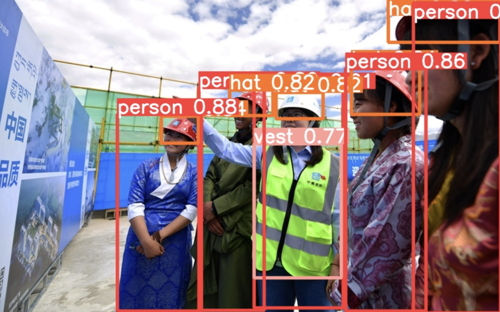
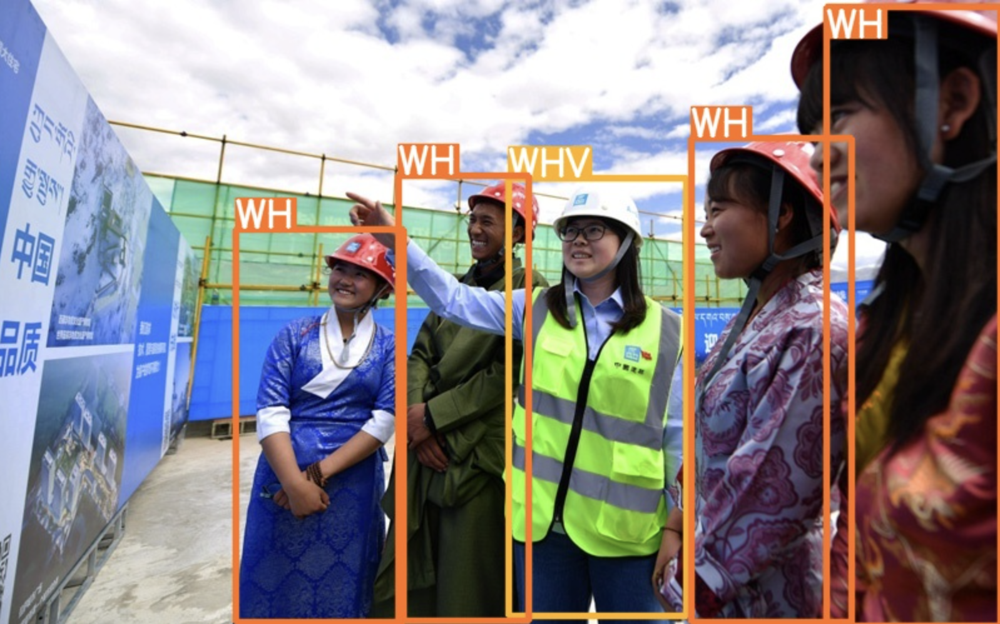

# PPE-Detect

This system is based on [Ultralytics yolov5](https://github.com/ultralytics/yolov5), [MiDaS](https://github.com/isl-org/MiDaS) monocular depth estimation model, and Hungarian Algorithm

## 0. Introduction

The system will first use YOLOv5 object detection algorithm to detect PPEs(personal protection equipments) and workers, then use Hungatian algorithm to match the boxes of PPEs with boxes of workers, with depth information from pre-trained model and IoU as the cost.

## 1. User guide

To use our system, you have to have a GPU with at least 8 GB GPU memory.

First, cd to our source folder:

cd source

Install following requirements:

pip install -r requirements.txt

Detect on image or video file or video stream from webcam:

for example, run detect on an image file:

python run.py --weights ppe_yolov5l.pt --conf 0.25 --source img.jpg --use_depth 

if you want to run on your webcam, use 0 as the source (assume the device number of your webcam is 0)

## 2. Examples

detection result

matching result

- worker with hat only is marked as <kbd>WH</kbd>.

- worker with hat and vest is marked as <kbd>WHV</kbd>.

